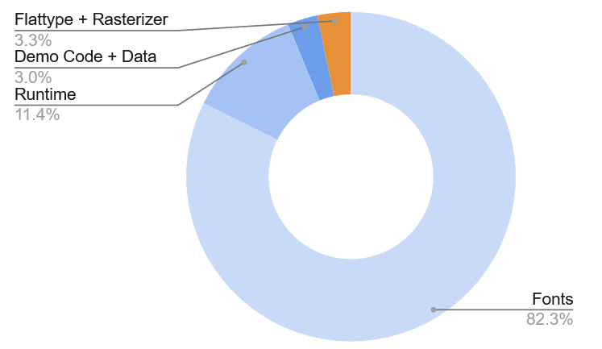

# Flattype on a Cheap Yellow Display (ESP32-2432S028R)

[<video controls src="https://github.com/waruyama/flattype-cyd-demo/blob/main/video/flattype-cyd-demo1.mp4" title="Demo of Flattype on Cheap Yellow Display"></video>
](https://github.com/user-attachments/assets/c9c6e607-fc47-4d57-8638-0d4b6ed81f2b)

## What is this?

This demo shows rendering of TrueType vector font in a very resource constained embedded environment using Flattype. Flattype is a tiny OpenType pipeline written in pure Rust — shaper, glyph-outline extractor, and anti-aliased rasterizer — runs fits inside an ESP32 with **320 KB of Ram and 4 MB of flash awith no PSRAM**. It can handle advanced typogaphy features like ligartures and complex scripts like Arabic, Indic, Khmer and Thai.

This repository is a self-contained demo for the **Cheap Yellow Display** (ESP32-2432S028R) — the popular ~$10 ESP32 dev board with a 320 × 240 ILI9341 LCD and an XPT2046 resistive touchscreen.

It runs the full OpenType pipeline live on the chip:

- **GSUB** substitution: ligatures, contextual rules, alternates, reverse contextual.
- **GPOS** positioning: kerning, mark-to-base, mark-to-mark, cursive attachment.
- **Bidi** (UAX #9) for mixed LTR/RTL text.
- Script-specific shaping: Arabic joining, Devanagari and other Indic reordering, Khmer, Myanmar, Hangul, Thai, and the Universal Shaping Engine.
- Both **TrueType (glyf)** and **PostScript (CFF)** outlines.
- An anti-aliased, gamma-corrected scanline rasterizer with strip-based output to the LCD.

The whole thing is reactive to a custom three-row touch gesture model: the top of the screen navigates between demos, the middle row navigates within a demo, and the bottom row is a swipe / slider area.

## Hardware

- **Cheap Yellow Display** (ESP32-2432S028R). Variants without the resistive touch panel will most likely not work.
- 320 × 240 ILI9341 LCD over SPI2 at 80 MHz with DMA.
- XPT2046 resistive touchscreen on SPI3 at 2 MHz.
- Standard 4 MB flash, no PSRAM, **~320 KB internal SRAM**.

## What's in the binary

Total flashed image is **~2.6 MB**, of which **~2.0 MB is fonts** from Google Fonts (embedded as `include_bytes!` in the binary's read-only data) and the remaining ~480 KB is code + data. Sizes are from `xtensa-esp32-elf-size` and a per-symbol breakdown via `xtensa-esp32-elf-nm` on a release build.

**Fonts** (read-only data, embedded in flash):

| Font | Size |
|---|---:|
| Noto Nastaliq Urdu | 517 KB |
| Hind | 285 KB |
| Noto Sans Arabic | 188 KB |
| NotoEmoji (subsetted) | 186 KB |
| Roboto Regular | 167 KB |
| Noto Sans Khmer | 102 KB |
| HennyPenny | 79 KB |
| Bonbon | 70 KB |
| SnowburstOne | 65 KB |
| Peralta | 57 KB |
| Almendra | 56 KB |
| Ultra | 50 KB |
| Assistant | 49 KB |
| Droid Serif | 43 KB |
| Architects Daughter | 37 KB |
| Orbitron | 24 KB |
| **Fonts subtotal** | **~2.0 MB** |

All are static monochrome vector fonts (not variable fonts). The fonts were downloaded from Google Fonts and are not subsetted (except for emoji); For a real product they would be slimmed down.

**Code and data** (~480 KB total):

| Component | Size |
|---|---:|
| **Flattype** (shaper, GSUB/GPOS, Bidi, script processing, table parsers) | **~63 KB** |
| Render path (`render`, `rasterizer2`, `flattener` from this demo) | ~13 KB |
| **Font shaping + rendering + rasterizing subtotal** | **~76 KB** |
| ESP-IDF C runtime (FreeRTOS, drivers, ROM glue) | ~147 KB |
| Rust `core` + `std` + `alloc` | ~118 KB |
| Backtrace machinery (`gimli`, `addr2line`, `rustc_demangle`) | ~56 KB |
| Demo logic (layout, touch, display, intro, the 5 demos, `main`) | ~17 KB |
| `compiler_builtins`, `esp-idf-hal`, `mipidsi`, other small crates | ~12 KB |
| Data (string literals, Unicode lookup tables, vtables, statics) | ~55 KB |
| **Code + data subtotal** | **~480 KB** |
| **Grand total** | **~2.6 MB** |

The headline number worth flagging: **the entire OpenType pipeline — shaping, outline extraction, flattening, and anti-aliased rasterizing — compiles to about 76 KB**. The largest single non-font cost is the ESP-IDF C runtime at ~147 KB, which is essentially fixed overhead for any Rust ESP32 program with `std` support — not specific to this demo.

## Demos

Five demos cycle with the **top row** of the touchscreen — left to go back, right to advance. The **middle row** navigates within a demo (e.g. cycling examples). The **bottom row** is a swipe / slider area whose meaning depends on the demo.

| Demo | What it does | Why it's cool |
|---|---|---|
| **Typography** | Five hand-picked typographic samples — Latin with ligatures, Nastaliq, Khmer, Devanagari, mixed Hebrew + Latin. The text is drawn in a light grey "ghost"; a slider on the bottom row reveals it character by character in black as you drag. Middle row cycles examples. | Forces the shaper to do its hardest work in real time on a $10 board: Latin ligature reveal (try `fi`, `ct`), Nastaliq's vertical stacking, Khmer subscripted clusters, Devanagari conjuncts, and bidirectional Hebrew with Latin punctuation. The slider lets you watch the order in which glyphs combine. |
| **Latin pulse** | A long Lorem Ipsum paragraph rendered in nine display fonts at variable size. Middle row taps switch font; the bottom row swipe scales 14–120 px continuously. | Word wrapping, kerning, and contextual substitutions on artistic display faces — at any size, recomputed each frame. The fonts are deliberately weird (Bonbon, Peralta, Henny Penny…) to show that the shaper isn't only happy with system Latin. |
| **Exotic pulse** | The same Lorem in Arabic, Devanagari, and Hebrew. Middle row cycles scripts; bottom row swipe scales size. | Cursive joining (Arabic), bidirectional layout (Hebrew embedded with Latin punctuation), and conjunct reordering (Devanagari) — all live, no pre-baked images. |
| **Emoji pulse** | A randomly-shuffled run of ~250 colour emoji. Middle row tap reshuffles; bottom row swipe scales. | Emoji glyphs are very curve-heavy — a single 90 px emoji can flatten to ~900 line segments. This stresses the rasterizer's per-glyph allocation path against a tight no-PSRAM heap. |
| **Random char** | One large character at 90 px, sampled from a pool of decorative Latin faces. Bottom row scrolls through letters and fonts deterministically. | Worst-case rasterizer load at full glyph size, plus the most direct way to flip through the display fonts. |

## Credits

- [Flattype](https://www.flattype.com) — the OpenType shaper and renderer, ported to Rust from the JavaScript original.
- [mipidsi](https://crates.io/crates/mipidsi) — ILI9341 driver.
- [esp-idf-hal](https://crates.io/crates/esp-idf-hal) — ESP-IDF Rust bindings.
- Fonts: Roboto, Noto Sans family, Hind, Almendra, Assistant, and the display faces — all from Google Fonts under the SIL Open Font License.

