# Flattype on a Cheap Yellow Display (ESP32-2432S028R)

[<video controls src="https://github.com/waruyama/flattype-cyd-demo/blob/main/video/flattype-cyd-demo-cHtd6wyP.mp4" title="Demo of Flattype on Cheap Yellow Display"></video>
](https://github.com/user-attachments/assets/e0aefb1e-3466-4e44-a137-e85ac51900db)

## What is this?

**All the text you see in this demo is rendered live on the chip from TrueType fonts. There are no prerendered bitmaps, no glyph atlases, nothing pre-baked. All the text goes through the full OpenType shaper and rasterizer.**

This demo shows rendering of TrueType vector fonts in a very resource-constrained embedded environment using Flattype. Flattype is a tiny OpenType pipeline written in pure Rust (shaper, glyph-outline extractor, and anti-aliased rasterizer) that fits inside an ESP32 with **320 KB of RAM, 4 MB of flash, and no PSRAM**. It can handle advanced typography features like ligatures and complex scripts like Arabic, Indic, Khmer, and Thai.

This repository is a self-contained demo for the **Cheap Yellow Display** (ESP32-2432S028R), the popular ~$10 ESP32 dev board with a 320 × 240 ILI9341 LCD and an XPT2046 resistive touchscreen.

It runs the full OpenType pipeline live on the chip:

- Bidirectional text ordering.
- Substitution: ligatures, contextual rules, alternates, reverse contextual.
- Positioning: kerning, mark-to-base, mark-to-mark, cursive attachment.
- Script-specific shaping: Arabic joining, Devanagari and other Indic reordering, Khmer, Myanmar, Hangul, Thai, and universal shaping for less common scripts.
- Both **TrueType (glyf)** and **PostScript (CFF)** outlines.
- Anti-aliased, gamma-corrected rendering, drawn to the LCD in horizontal strips.

Navigation works via a three-row touch gesture model: the top of the screen cycles between demos, the middle row navigates within a demo, and the bottom row is a swipe / slider area.

## Demos

Six demos cycle with the **top row** of the touchscreen: left to go back, right to advance. The **middle row** navigates within a demo (e.g. cycling examples). The **bottom row** is a swipe / slider area whose meaning depends on the demo.

<table>
  <colgroup>
    <col style="width: 22%">
    <col style="width: 22%">
    <col style="width: 56%">
  </colgroup>
  <thead>
    <tr>
      <th>Demo / what it does</th>
      <th>Image</th>
      <th>Why it's cool</th>
    </tr>
  </thead>
  <tbody>
    <tr>
      <td rowspan="4"><strong>Typography</strong> Four hand-picked typographic samples: Latin with ligatures, Nastaliq, Khmer, Devanagari. The text is drawn in a light grey "ghost"; a slider on the bottom row reveals it character by character in black as you drag. Middle row cycles examples.</td>
      <td>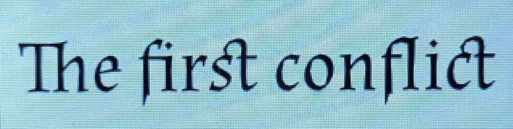</td>
      <td>Latin ligature reveal: <code>Th</code>, <code>fi</code>, <code>st</code>, <code>fl</code>, and <code>ct</code> combine into ligatures as the slider crosses each glyph.</td>
    </tr>
    <tr>
      <td>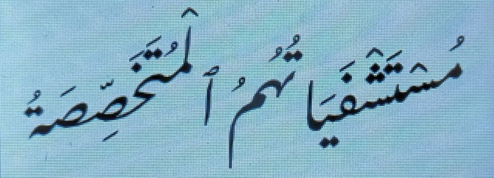</td>
      <td>Nastaliq's diagonal vertical stacking, considered one of the most demanding scripts for shaping.</td>
    </tr>
    <tr>
      <td>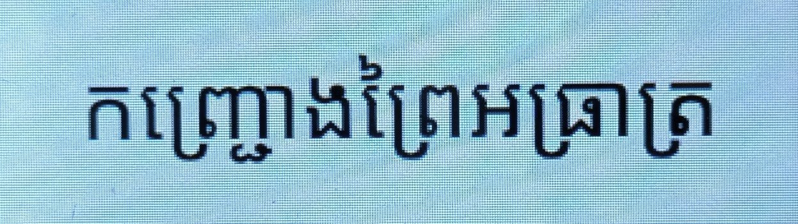</td>
      <td>Khmer subscripted consonant clusters: characters stack below the baseline in their own subjoined forms.</td>
    </tr>
    <tr>
      <td>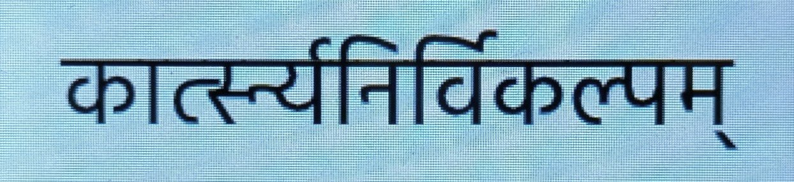</td>
      <td>Devanagari conjuncts joined under the shirorekha (top bar) into a single visual unit.</td>
    </tr>
    <tr>
      <td rowspan="2"><strong>Latin text</strong> A long Lorem Ipsum paragraph rendered in nine display fonts at variable size. Middle row taps switch font; the bottom row swipe scales 14–120 px continuously.</td>
      <td>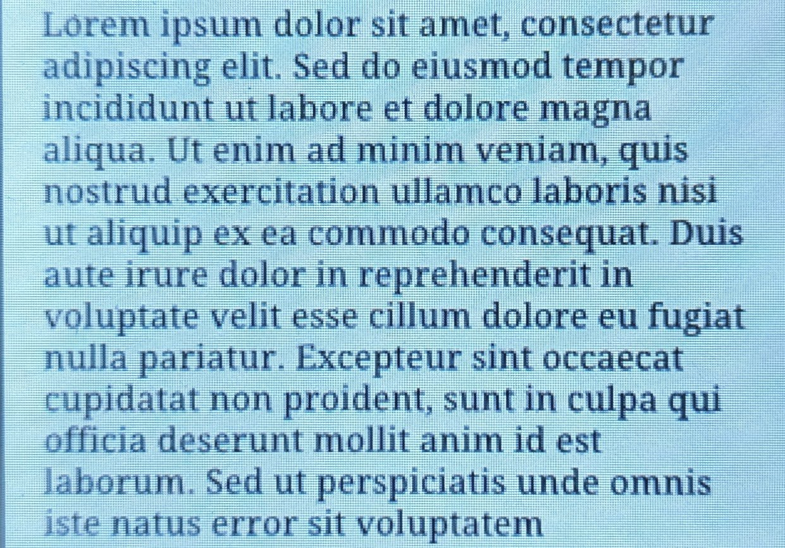</td>
      <td>Word wrapping, kerning, and contextual substitutions.</td>
    </tr>
    <tr>
      <td>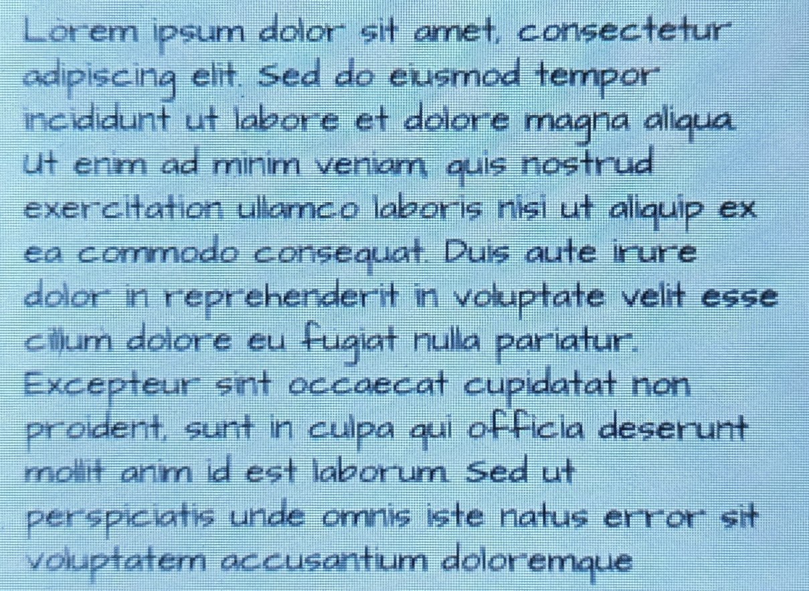</td>
      <td>Deliberately weird display faces (Bonbon, Peralta, Henny Penny…) show the shaper isn't only happy with standard serif and sans-serif fonts.</td>
    </tr>
    <tr>
      <td rowspan="3"><strong>Complex scripts</strong> The same Lorem in Arabic, Devanagari, and Hebrew. Middle row cycles scripts; bottom row swipe scales size.</td>
      <td>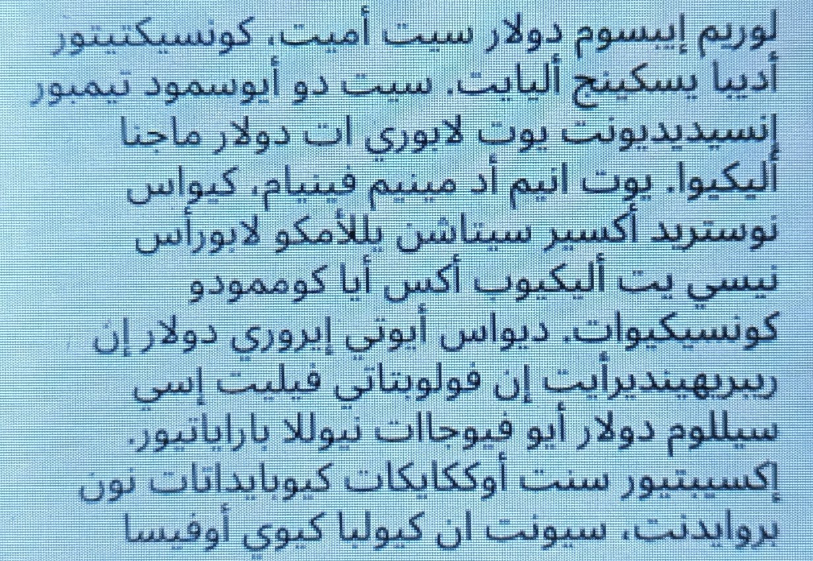</td>
      <td>Cursive joining: each letter takes initial/medial/final/isolated forms depending on its neighbours, all decided live.</td>
    </tr>
    <tr>
      <td>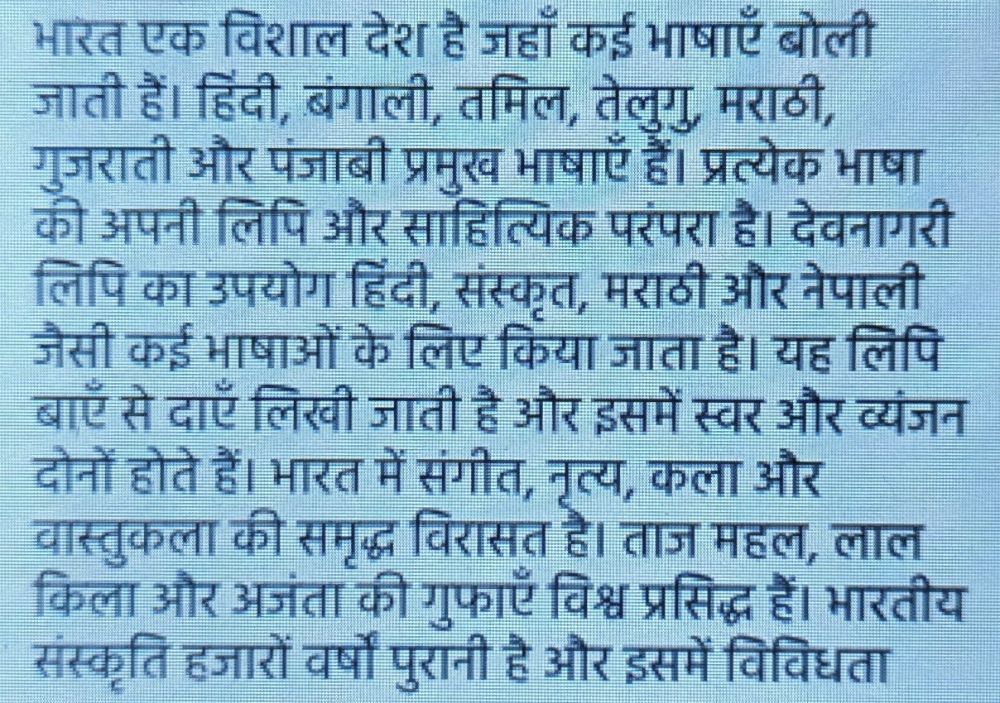</td>
      <td>Devanagari conjunct reordering: vowel marks visually precede consonants they logically follow.</td>
    </tr>
    <tr>
      <td>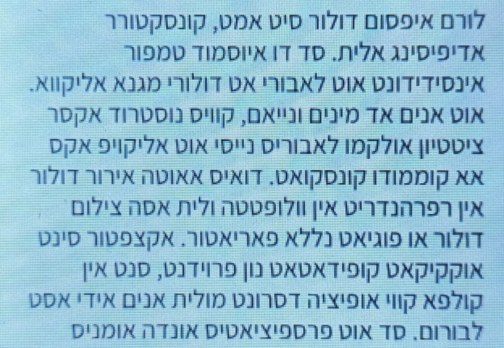</td>
      <td>Right-to-left layout, with Latin punctuation and digits embedded inline (live bidi).</td>
    </tr>
    <tr>
      <td><strong>Emoji</strong> A randomly shuffled run of ~250 colour emoji. Middle row tap reshuffles; bottom row swipe scales.</td>
      <td>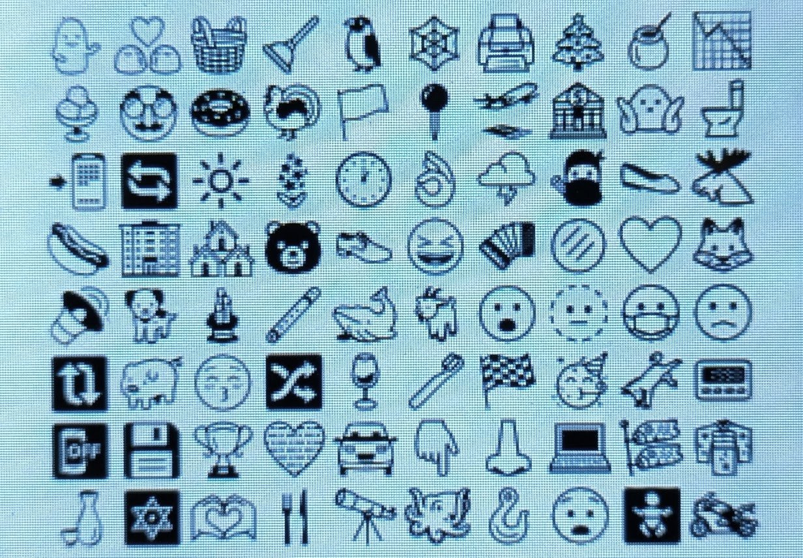</td>
      <td>Emoji glyphs are very curve-heavy: a single 90 px emoji can flatten to ~900 line segments. This stresses the rasterizer's per-glyph allocation.</td>
    </tr>
    <tr>
      <td><strong>Random char</strong> One large character at 90 px, sampled from a pool of decorative Latin faces. Bottom row scrolls through letters and fonts deterministically.</td>
      <td>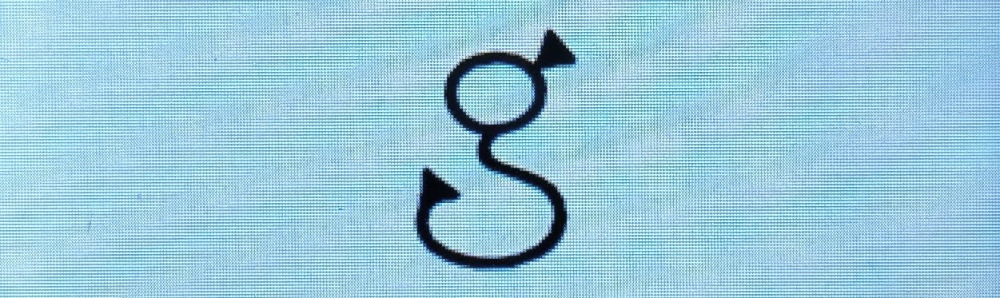</td>
      <td>Swapping fonts is essentially free. Fonts take almost no memory in RAM, so multiple fonts can be held in memory at the same time. This makes switching between fonts as fast as rendering different text from the same font.</td>
    </tr>
    <tr>
      <td><strong>Colour on dark</strong> A short title rendered with per-glyph colour over a dark background.</td>
      <td>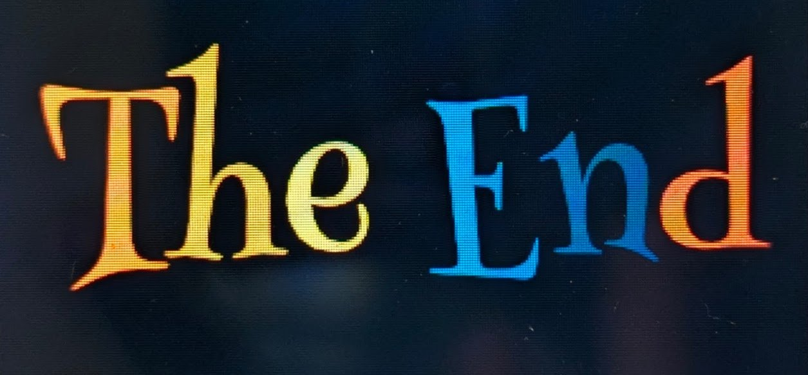</td>
      <td>Rendering isn't locked to black-on-light. Each glyph can take its own colour and composite onto an arbitrary background, opening the door to theming and accents.</td>
    </tr>
  </tbody>
</table>

## Hardware

- **Cheap Yellow Display** (ESP32-2432S028R). Variants without the resistive touch panel will most likely not work.
- 320 × 240 ILI9341 LCD over SPI2 at 80 MHz with DMA.
- XPT2046 resistive touchscreen on SPI3 at 2 MHz.
- Standard 4 MB flash, no PSRAM, **~320 KB internal SRAM**.

## Performance

Stage-by-stage timings measured on the CYD. **Shaping** happens once when starting the demo or when changing the text; all other steps run on every font-size change.

All measurements are with smallest font size and maximum number of visible glyphs. 13 lines of text with approx. 200-800 glyphs (depending on font and script).

- **Refresh subtotal** = rendering + rasterizing + pushing
- **Total** = refresh + shaping (the cost of the first frame after a text change)

| Stage                | Single glyph |          Latin |     Arabic | Devanagari |     Hebrew |      Emoji |
|----------------------|-------------:|---------------:|-----------:|-----------:|-----------:|-----------:|
| Number of glyphs     |            1 |        360-548 |        809 |        618 |        623 |        208 |
| **Shaping**          |         0 ms |       12-44 ms |      90 ms |     215 ms |      34 ms |       8 ms |
| Line-breaking        |         1 ms |        7-10 ms |      14 ms |      14 ms |      13 ms |       0 ms |
| Rendering            |         0 ms |      25-100 ms |      51 ms |      25 ms |      19 ms |      93 ms |
| Flattening           |         0 ms |       13-65 ms |      37 ms |      21 ms |      14 ms |      56 ms |
| Rasterizing          |       1-2 ms |      35-190 ms |     130 ms |     112 ms |      80 ms |     214 ms |
| Pushing              |        18 ms |          18 ms |      19 ms |      19 ms |      18 ms |      19 ms |
| Other                |         0 ms |           3 ms |       4 ms |       3 ms |       2 ms |       2 ms |
| **Refresh subtotal** |    **21 ms** | **130-340 ms** | **258 ms** | **206 ms** | **148 ms** | **388 ms** |
| **Total**            |    **21 ms** | **145-370 ms** | **348 ms** | **421 ms** | **182 ms** | **396 ms** |

These figures are a first pass, not a ceiling. Performance has already been tuned, but there's headroom to do better.

## What's in the binary

Total flashed image is **~2.6 MB**, of which **~1.9 MB is fonts** from Google Fonts (embedded as `include_bytes!` in the binary's read-only data) and the remaining ~480 KB is code + data. Sizes are from `xtensa-esp32-elf-size` and a per-symbol breakdown via `xtensa-esp32-elf-nm` on a release build.

**Code and data** (~480 KB total):

| Component                                                          |         Size |
|--------------------------------------------------------------------|-------------:|
| **Flattype** code and data (bidi, shaper, renderer, rasterizer)    |  **~135 KB** |
| Render path (flattener, rasterizer, pushing)                       |       ~35 KB |
| **Text shaping + rendering + rasterizing subtotal**                |  **~170 KB** |
| Demo logic (layout, touch, display, intro, the 6 demos, `main`)    |       ~30 KB |
| ESP-IDF C runtime (FreeRTOS, drivers, ROM glue)                    |      ~145 KB |
| Rust (`core`, `std` + `alloc`)                                     |      ~155 KB |
| Backtrace machinery (`gimli`, `addr2line`, `rustc_demangle`, etc)  |       ~85 KB |
| `compiler_builtins`, `esp-idf-hal`, `mipidsi`, other small crates  |        ~8 KB |
| Misc rodata not attributable above (vtables, format strings, etc.) |       ~20 KB |
| **Code + data subtotal**                                           |  **~480 KB** |
| **Fonts (16 .ttf files embedded via include_bytes!)**              | **~1.93 MB** |
| **Grand total**                                                    |  **~2.6 MB** |

The headline number worth flagging: **the entire OpenType pipeline (shaping, outline extraction, flattening, and anti-aliased rasterizing) compiles to about 170 KB**. The largest single non-font cost is the ESP-IDF C runtime at ~145 KB, which is essentially fixed overhead for any Rust ESP32 program with `std` support, not specific to this demo.

**Fonts** (read-only data, embedded in flash): Noto Nastaliq Urdu (517 KB), Hind (285 KB), Noto Sans Arabic (188 KB), NotoEmoji subsetted (186 KB), Roboto Regular (167 KB), Noto Sans Khmer (102 KB), Henny Penny (79 KB), Bonbon (70 KB), SnowburstOne (65 KB), Peralta (57 KB), Almendra (56 KB), Ultra (50 KB), Assistant (49 KB), Droid Serif (43 KB), Architects Daughter (37 KB), and Orbitron (24 KB). **Fonts subtotal: ~1.93 MB.**

All are static monochrome vector fonts (not variable fonts). The fonts were downloaded from Google Fonts and are not subsetted (except for emoji); for a real product they would be slimmed down.

## Credits

- [Flattype](https://www.flattype.com): the OpenType shaper and renderer, ported to Rust from the JavaScript original.
- [mipidsi](https://crates.io/crates/mipidsi): ILI9341 driver.
- [esp-idf-hal](https://crates.io/crates/esp-idf-hal): ESP-IDF Rust bindings.
- Fonts: Roboto, Noto Sans family, Hind, Almendra, Assistant, and the display faces, all from Google Fonts under the SIL Open Font License.

